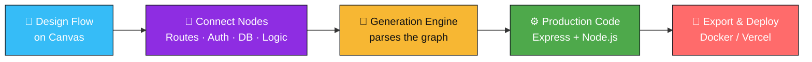

<div align="center">


<br/>

[](https://git.io/typing-svg)

<br/>

<p align="center">
  
  
  
  
  
</p>

<p align="center">
  
  
  
  
  
  
</p>

<br/>

<a href="#-installation--running-the-project"></a>
<a href="#-contributing"></a>
<a href="https://github.com/Gaurav775-Git/Server_Flow/issues"></a>
<a href="#-roadmap"></a>

</div>


## 📖 Overview

**Server Flow** turns backend architecture into a visual, drag-and-drop experience — think *n8n* meets *code generation*. Instead of hand-writing routes, controllers, and boilerplate, you design the flow of your API on a canvas, and Server Flow compiles it into clean, production-ready server code.

> 🧩 **Drag** a node → 🔗 **Connect** the logic → ⚡ **Generate** the backend. That's it.

<div align="center">

</div>

### ✨ Why Server Flow?

<table>
<tr>
<td width="50%" valign="top">

**🎯 Visual First**
Design your entire API surface — routes, middleware, DB calls — as a connected flow instead of scattered files.

**⚡ Instant Code Generation**
Every flow compiles down to real, readable Express/Node code you actually own — no vendor lock-in.

</td>
<td width="50%" valign="top">

**🧱 Composable Nodes**
Reusable building blocks (auth, validation, DB queries, webhooks) that snap together like Lego.

**🐳 Deploy Anywhere**
Export a Dockerized project or ship straight to Vercel — the generated code is yours to run wherever you like.

</td>
</tr>
</table>


## 📋 Table of Contents

<table>
<tr>
<td valign="top" width="50%">

- [🛠️ Technology Stack](#-technology-stack)
- [🧠 How It Works](#-how-it-works)
- [📦 Prerequisites](#-prerequisites)
- [📂 Project Structure](#-project-structure)
- [🚀 Installation](#-installation--running-the-project)

</td>
<td valign="top" width="50%">

- [🔄 Development Workflow](#-development-workflow)
- [🗺️ Roadmap](#-roadmap)
- [🤝 Contributing](#-contributing)
- [👥 Team](#-team)
- [📜 License](#-license)

</td>
</tr>
</table>


## 🛠️ Technology Stack

<div align="center">

| Component | Technology | Purpose |
| :---: | :---: | :--- |
| 🎨 **Frontend** | `React 18` + `React Flow` | Visual drag-and-drop canvas |
| ⚙️ **Backend** | `Node.js` + `Express` | REST API & orchestration |
| 🗄️ **Database** | `MongoDB` *(Optional)* | Persisting workflows |
| 🧬 **Code Generation** | `Custom Engine` | Converts flows → server code |
| 📦 **Deployment** | `Docker` / `Vercel` | Ship anywhere |

</div>


## 🧠 How It Works




## 📦 Prerequisites

Before you begin, make sure you have the following installed:

```bash
# Check versions
node --version   # v18.x or higher
npm --version    # v9.x or higher
git --version    # v2.x or higher
```


## 📂 Project Structure

```text
Server_Flow/
├── client/          # React Frontend — the visual flow canvas
├── server/          # Node.js Backend — API & code-gen engine
├── mcp-service/     # Microservice / MCP handling
├── .env.example     # Environment variables template
├── package.json     # Root package configuration
└── README.md
```


## 🚀 Installation & Running the Project

### 1️⃣ Clone the repository
```bash
git clone https://github.com/Gaurav775-Git/Server_Flow.git
cd Server_Flow
```

### 2️⃣ Backend Setup
```bash
cd server
npm install
npm start &
cd ..
```

### 3️⃣ Frontend Setup
```bash
cd client
npm install
npm run dev &
```

> 💡 **Note:** The frontend and backend run concurrently. Open **`http://localhost:5173`** (or your configured port) to view the app.


## 🔄 Development Workflow

> 🚨 **IMPORTANT:** Do not push your code directly to the `main` branch. Follow these steps strictly.

<table>
<tr><td>

**Step 1 — Get Latest Code**
```bash
git checkout main
git pull origin main
npm install
```

**Step 2 — Create Feature Branch**
```bash
git checkout -b feature/[your-feature-name]
```

**Step 3 — Work & Commit**
```bash
git status
git add .
git commit -m "feat: [your commit heading]" -m "[description of your commit]"
```

**Step 4 — Push & Collaborate**
```bash
git push -u origin feature/[your-feature-branch-name]

# Future work on the same branch...
git add .
git commit -m "fix: improve login validation"
git push
```

</td></tr>
</table>


## 🗺️ Roadmap

- [x] Visual flow canvas with React Flow
- [x] Core code-generation engine
- [x] Docker export
- [ ] Node marketplace for community-built blocks
- [ ] Live preview / test-run flows before export
- [ ] GraphQL generation support
- [ ] One-click Vercel deploy from canvas


## 🤝 Contributing

Contributions are what make the open-source community amazing! Please follow the [Development Workflow](#-development-workflow) above, and make sure your PR is linked to an open issue.

<div align="center">
<a href="https://github.com/Gaurav775-Git/Server_Flow/graphs/contributors">
  
</a>
</div>


## 👥 Team

<div align="center">
<sub>Maintained by <a href="https://github.com/Gaurav775-Git">Gaurav775-Git</a> and the Server Flow community.</sub>
</div>


## 📜 License

Distributed under the **MIT License**. See `LICENSE` for more information.


<div align="center">

### ⭐ If Server Flow saves you boilerplate, consider starring the repo!

<a href="https://star-history.com/#Gaurav775-Git/Server_Flow&Date">
  
</a>

</div>


<div align="center">
<sub>Built with ❤️ for the backend community.</sub>
</div>
